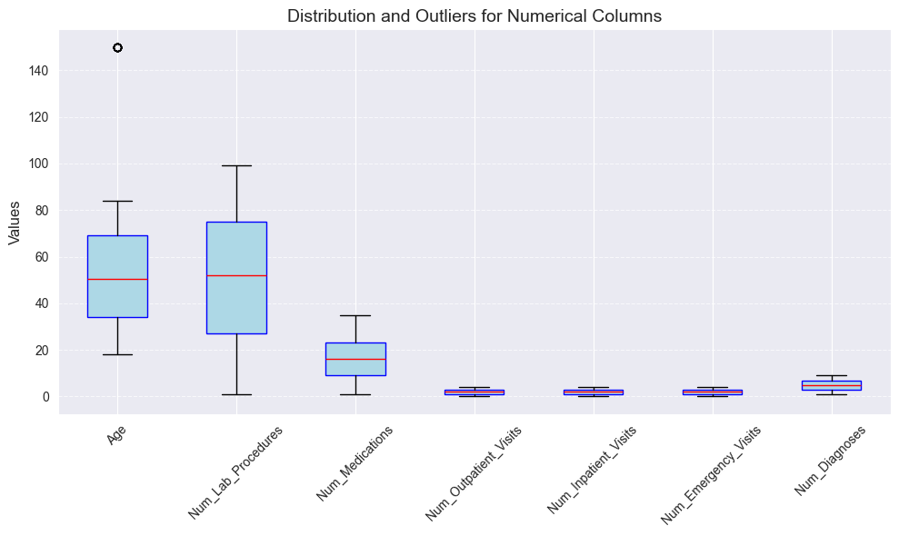

# Evolent ML Engineer Assignment

This repository is a demonstration on how to create an end-to-end pipeline in Azure ML Studio for a healthcare dataset
given by Evolent Health for  ML Engineer assignment. Below you will find the objectives set by Evolent, my
thoughts on how I approach each objective, relevant notes that explain my thought process or pitfalls I avoided. This
does not fully explain how to use Azure ML Studio or how to set it up, but rather what it can look like once it has been
configured for an ML Engineer or Data Scientist. 

Additionally, my models are not rigorously fine-tuned. The point of this is to see if I can create and maintain a ML
pipeline in 48 hours, not refine a model. 

I did use AI Assisted tools like Github Copilot to help create and refine this code. I strongly believe in AI tools
to better my work, as it can help me better understand errors, improve coding speed, and use common patterns more
efficiently. I understand there can be a contention for AI generated code, but I believe that this is little different
from using Stack Overflow. Both are tools that can help speed up and aide in solving your coding issues, but if you
blindly follow them without at least a vague understanding of what you are doing, you will quickly run into problems.
Additionally, whether I like it or not, these tools are not going anywhere. Either I adapt to them now,
or get left behind in the future.

# Problem Statement
## Exploratory Data Analysis (EDA)
- Load the `data/hospital_readmissions.csv` dataset and perform initial data exploration.
- Summarize the dataset with descriptive statistics.
- Visualize the data to identify patterns, trends, and potential outliers.
- Handle missing values and perform data cleaning as necessary.
- Generate a report summarizing your findings.

### EDA Notes
- Surprisingly, the data is almost perfectly balanced for Readmitted vs not (497 vs 503). This is a very rare occurrence
for a healthcare dataset. It is also worth noting this is a relatively small dataset.
- The only column that needs to be dropped is `Patient_ID` simply because it will not add anything to the model.
- The only column that explicitly had missing values was `A1C_Result`, with **433 missing values**. In this case, it is a
categorical column with only two other values, so in the model I will fill in the missing values with the string "Missing"
so it can be used a feature in case it is useful during training.
- Below is a Box Plot for each of the numerical columns. 

Right away I notice the age outlier. These people seems to be over the age of 140! A quick google finds that the oldest 
person to ever live was Jeanne Calment, who lived to be 122 years old. So either google is lying (possible), or
these data points were messed up at intake (more likely). When I dug into the data, it appears 10 rows were at the age
of 150, so I will remove those from our dataset before training.
- I preformed Chi-Squared tests on the categorical variables against `Readmitted` target column, but none where significant.
When preforming T-Tests on the numerical values against `Readmitted`, only `Num_Diagnoses` column was significant. This
means this might be an important feature for us when training a model.


## **Modeling**
- Preprocess the data (e.g., encoding categorical variables, scaling numerical features).
- Split the data into training and testing sets.
- Train at least two different machine learning models (e.g., Logistic Regression, Random Forest, XGBoost).
- Evaluate the models using appropriate metrics (e.g., accuracy, precision, recall, F1-score, ROC-AUC).
- Select the best-performing model and fine-tune its hyperparameters.
- Save the final model using a serialization format (e.g., joblib, pickle).

### Modeling Notes
- Normally for healthcare models, I am more concerned for precision when measuring how well I did in a model. The reason
is I want to minimize false positives since in healthcare, false positives can be very costly (and potentially dangerous).
However, since this model is just for an exercise, and it doesn't seem like this outcome is directly tied to
someone getting treatment or not, or even whether to approve healthcare or not, I am not going to optimize for false positives.
- I used 

[//]: # (### **Unit and Integration Testing**)

[//]: # ()
[//]: # (- Write unit tests for individual functions and components.)

[//]: # (- Write integration tests to ensure the entire pipeline works as expected.)

[//]: # (- Use a testing framework like pytest.)

## **Deployment**
- Deploy an API for predicting hospital readmissions using your model. The model takes various patient attributes 
as input and returns a prediction indicating whether the patient is likely to be readmitted to the hospital,
along with the probability of that prediction.

### Deployment Notes
- Deployment is pretty simple in Azure ML Studio.

# Requirements for Local Development
- install and login in azure using azure cli:[Azure CLI](https://learn.microsoft.com/en-us/cli/azure/get-started-with-azure-cli)
  - make sure to login using `az login` inside of this project directory.
- obtain the workspace configuration file from the azure ml studio and place it in the .azureml folder OR rename the 
`template_config.json` to `config.json` and update the values.
- install python 3.11 and the required packages in the `requirements.txt` file.

# Explanations of Files

- `.azureml/config.json`
File for connecting to azure ml workspace. Defines the workspace, resource group, and subscription id.

- `data/hospital_readmissions.csv/parquet`
The dataset for the assignment. The data is loaded from the csv file and saved as a parquet file for faster loading.

- `src/model.py`
The model class for the assignment. The model uses MLFow (native for Azure ML Studio).

- `src/train.py`
Trains the model based on the `model.py` file.

- `models/`
Folder holding our locally developed MLFlow models.

- `src/backend/`
Local FastAPI server for running our model. You can send data to it using the `/predict` POST method to predict using one
of the trained models.

- `azureml_e2e_pipeline.py`
This file contains the end-to-end pipeline for the assignment. It creates the data asset, creates the compute, 
trains the model, and registers the model in the model registry.

- `azure_deploy_model.py`
This file contains the code for deploying the model as a webservice to azure ml studio.

- `local_e2e_pipeline.py`
Alternate to azureml_e2e_pipeline.py where the model is trained locally using MLFlow. The deployment is done locally
using FastAPI in `src/backend`.

- `notebooks/data_exploration_mnb.py`
a notebook demostrating the data exploration and subsequent report from that exploration. This notebook uses [marimo](https://marimo.io/),
which is a more modern take on a jupyter notebook. This one allows for more interaction and plays with git much nicer
than jupyter does since it stored as a python script, not a json. You can run it by installing `marimo` and then calling:
```
marimo edit data_exploration_mnb.py
```

- `job-env/conda_dependencies.yml`
Conda file defining the python version and libraries required to run these scripts in Azure ML. I
use this file to help build an environment in Azure ML (effectively docker container).
I tried using Python 3.11, but there was a `NotImplementedError` for some of the libraries. So
for this project I am sticking with Python 3.10. Based on the environments I have seen in Azure ML,
it seems this is the out-of-the-box supported python version.
For the Docker Image, I used one from microsoft: [image](mcr.microsoft.com/azureml/minimal-ubuntu22.04-py39-cpu-inference:latest).

# Useful Documentation
- [Azure ML Cheatsheet](https://azure.github.io/azureml-cheatsheets/)
- [Create Compute Cluster using ML Client](https://learn.microsoft.com/en-us/azure/machine-learning/how-to-create-attach-compute-cluster?view=azureml-api-2&tabs=python)
  - This artcile is useful for creating a compute cluster using the Azure ML SDK. 
  - WARNING: There is a naming collision with `AmlCompute` for the libraries `azure.ai.ml.entities` and `azureml.core.compute`.
  I am using the former for creating the compute cluster, since it allows me to use  ml_client instead of the workspace object.
- [Using Azure Jobs to track and train models in MLFlow](https://learn.microsoft.com/en-us/azure/machine-learning/how-to-use-mlflow-cli-runs?view=azureml-api-2&tabs=interactive%2Ccli)
- [Manage model registry in Azure ML](https://learn.microsoft.com/en-us/azure/machine-learning/how-to-manage-models-mlflow?view=azureml-api-2)

